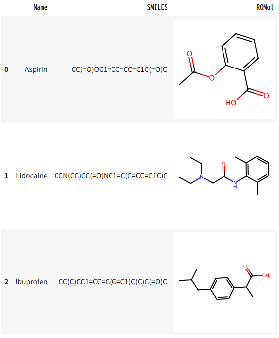

# chemdraw-to-python-automation

## 🎯 目的
ChemDrawでの構造式作図をPythonとRDKitで自動化するツール。
構造画像とExcel出力に対応。

## 🔍 出力例（構造式付きデータフレーム・3D構造の可視化）

## 📦 主な機能
- PubChemから化合物名をもとにSMILESを取得
- RDKitで構造式を描画（個別PNG / グリッド画像）
- Pandas + PandasToolsで構造式付きDataFrame生成
- Excelに構造式付きで出力
- 3D構造の可視化
